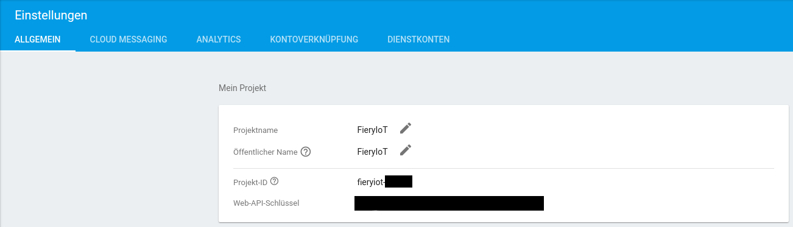
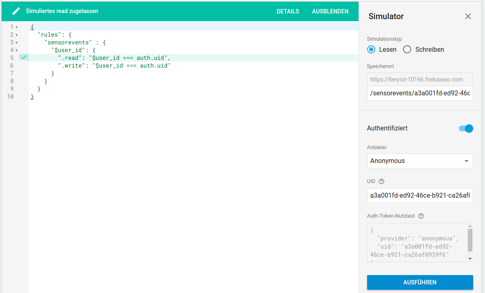
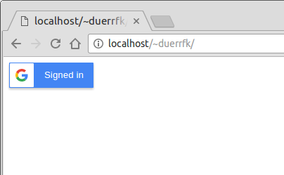
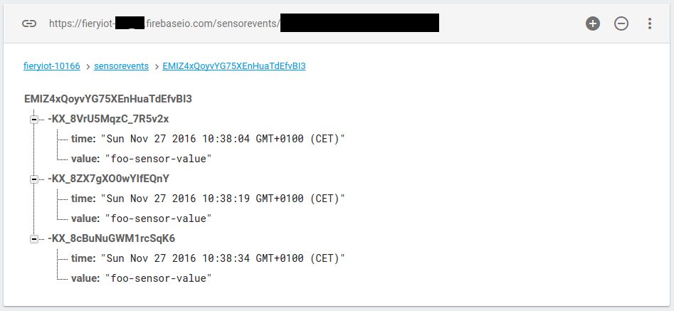

***Fiery IoT: A Tutorial on Implementing IoT Cloud Services with Google Firebase***

# Abstract

In this tutorial, we will show how to implement an IoT service with Google Firebase. The IoT service consists of IoT home gateways of users for connecting sensors, and mobile apps as clients. In particular, we will show how to use the Firebase realtime database for storing sensor events and and notifying clients in realtime about events.

In the first part, we will show how to connect the IoT home gateways of users to the realtime database, and how to use Google accounts as authentication method for the IoT home gatways of individual users to implement a multi-tenancy service with Firebase. For implementing IoT gateways, we will use Node.js plus an Apache web-server. 

In part two, we connect mobile apps receiving realtime notifications of sensor events.  

Although we take an IoT service as motivating example, many parts of the tutorial are generic and also applicable to mobile services in general. Thus, this tutorial could also be useful for other Firebase users beyond the IoT.

All code of the tutorial can be found at [GitHub](https://github.com/duerrfk/FieryIoTTutorial).

# Motivation: The Detect-Store-Notify Pattern

Google Firebase is a cloud-based application platform that was originally developed for supporting mobile apps. In particular, Firebase includes a so-called realtime database that besides just storing data can also sync mobile clients in "realtime". To this end, apps can register for data change events, and whenever data is updated, the app gets a notification and a snapshot of the changed data items. In this tutorial, we will show that such a realtime database not only facilitates the development of mobile apps in general, but also IoT applications and services in particular.

We observe that many IoT applications follow a pattern that can be best described as "detect-store-notify". First, an event is detected. In IoT scenarios such events are often triggered by changes in the physical world detected by sensors. Two very simple examples are the ringing of a door bell (door bell event) or a temperature sensor detecting a sensor value higher or lower than a user-defined threshold value (temperature event). Since typically events are defined to detect some meaningful change in the physical world like "a person standing at the front door" (door bell event) or "temperature in living room too low" (temperature event), they serve as input to some control application, which automatically triggers actions, or an app implementing a user interface to notify the user. For instance, a control application could automatically turn-up the heating after a "temperature low" event, or a notification could be presented on a mobile phone after a door bell event. In any case, we need to forward an event notification to some application. 

At the same time, we often want to keep a history of past events, i.e., we want to store sensor events persistently in a database. Then later the user can get an overview of what happened, or we can analyze event histories. In general, in the age of "big data", there seems to be a trend not to discard data, which later could prove to be useful, but to keep it for later processing, data mining, or machine learning.

A realtime database as included with Firebase covers both, the storage of data as well as sending notifications. Whenever a sensor event is written to the database, a value update is sent out to subscribers. The lean-and-mean tree-based data scheme of Firebase, which is similar to JSON objects, makes it easy to structure your data to allow for targeted subscriptions. For instance, one could add a sub-tree of sensor ids to let applications register to updates of individual sensors. At the same time, we could add events to a sub-tree of sensor types like temperature, door bell, etc. to subscribe to events by the type of sensors:

```
|
|--sensorid
|  |
|  |--<sensor id 1>
|  |  |
|  |  |--<sensor event 1>
|  |  |  |
|  |  |  |--<sensor data>
|  ...
|
|--sensortype
|  |
|  |--temperature
|  |  |
|  |  |--<sensor id 1>
|  |  |  |
|  |  |  |--<sensor event 1>
|  |  |  |  |
|  |  |  |  |--<sensor data>
|  |  ...
|  |
|  |--doorbell
|  |  |
...
```

Note that redundant data of the same sensor event is stored several times in the database, once in the sensor id sub-tree and once in the sensor type sub-tree. This denormalized storage of redundant data might seem counter-intuitive for users of relational databases. However, it is required for efficiently retrieving data and subscribing to events in Firebase by selecting a tree node subsuming all of its child nodes. Notifications are then sent out for all changes in a sub-tree rooted at the node of interest. 

Of course, you could use dedicated services for both individual functions (storing and notifications), for instance, an MQTT messaging service plus a database like Mongo DB. However, setting up and connecting these services and apps is more complex than just using a realtime database offered as a single integrated service. As we will see during this tutorial, the Firebase realtime database offered as a software service by Google makes it very easy to connect an IoT gateway and apps to the realtime database and implement functions for reading, writing, and eventing with just a few lines of code. In addition, Firebase handles user authentication, multi-tenancy, and scalability in an elegant and easy way.

# Goal of this Tutorial

In this tutorial, we show step-by-step how to implement a simple IoT service with Google Firebase. The architecture of this IoT service consists of three types of components:

* Sensors detecting events and sending them to the private IoT home gateway of the owner of the sensors. 
* IoT home gateways installed in the home network of each user (sensor owner). These gateways collect sensor events, and possibly pre-filter and enrich them, for instance by comparing the sensor value to a threshold and adding a timestamp. Then events are forwarded by the IoT home gateway to the Firebase database running in the Google cloud.
* The Firebase realtime database storing event histories and sending event notifications to the mobile app of the user or other services interested in sensor events.

```
sensor 1 --|
           |                  sensor events
sensor 2 ----> IoT Gateway ----------------|        Mobile App
           |   of user 1                   |        of user 1
sensor n --|                               |             ^
                                           v             |  notification
                                         Google ---------|
                                        Firebase  
                                    Realtime Database ---|
                                           ^             |  notification
                                           |             v
sensor 1 --|                               |        Mobile App 
           |                sensor events  |        of user 2
sensor 2 ----> IoT Gateway ----------------|
           |   of user 2
sensor n --|
```

The IoT service should serve a larger population of users, each one with his own sensors and IoT home gateway, with only one Firebase database (multi-tenancy). In other words, in this tutorial, we take the role of an IoT service provider offering an IoT smart-home service for many customers. Setting up a dedicated Firebase database for each customer would be too costly and would not scale with the number of customers in terms of complexity. Instead, we have one database for all customers/users. Each user should only have access to his own data and events. Consequently, the Firebase database must implement access control to protect datasets of different users.

We will not pay much attention to the sensor part and connecting sensors to the IoT home gateway, and rather focus to the components connected to the Firebase database, i.e., the IoT home gateway and apps. If you are interested in how to connect sensors to the IoT home gateway, you could have a look at our [Door Bell 2.0 project](https://github.com/duerrfk/doorbell20), which connects a simple door beel sensor via Bluetooth Low Energy (BLE) to a Node.js IoT gateway. It should be rather straightforward to merge the Node.js code from the Door Bell 2.0 project and the code of the IoT gateway presented in this tutorial. 

All code of the tutorial can be found at [GitHub](https://github.com/duerrfk/FieryIoTTutorial).

We first look at how to integrate IoT gateways of implemented in Node.js with Firebase, before we consider the synchonization of mobile apps implemented in Android with Firebase.

# Setting up Firebase

We want all sensor events to be stored in the Firebase database. Obviously, to this end, we first need to set up a database in Firebase:

1. Log-in to Firebase at https://console.firebase.google.com/
2. Create a new project. We give this project the name "FieryIoT". Firebase automatically assigns a project id (say "fieryiot-12345") and Web API key (say "abcdefghijklmnopqrstuvwxyz1234567890"), as you can verify by showing the project settings (wheel symbol). 



We later will use Google user accounts to sign-in to Firebase to protect and isolate data of different users. To this end, we must enable the corresponding authentication method. In the Firebase console, go to "Authentication" and enable the "Google" authentication method. Here, you can also show your web-client id, which is later used during authentication. The web-client id should look like this:

```
1234567890123-12345678901234567890abcdefghijklmnopqrstuvwxyz.apps.googleusercontent.com
```

Next, we need to define a schema and access rules for our database. Firebase uses a tree-based structure for the database similar to JSON objects. Our database has the following tree structure:

```
|
|--sensorevents
   |
   |--<user1 id>
   |  |
   |  |--<event id>
   |     |
   |     |--<event data 1>
   |     |
   |     |--... 
   |
   |--<user2 id>
   |  |
   |  |--<event id>
   |     |
   |     |--<event data 1>
   |     | 
   |     |--...
   |
   |--...
``` 

Compared to the example in the motivation, where we used different sub-trees for different sensors and sensor types, this example is simpler for the sake of a simpler description. However, extensions should be straightforward.

Note that every user has his own branch defined by his user id under the node `sensorevents` to store his own IoT events (e.g., a door bell event, door unlock events, etc.). Actually, we do not need to define this structure in the Firebase console, unlike in an SQL database where you would need to define the table structure first before storing data. Firebase is schemaless, however, we could define validation rules to ensure consistency of stored data, which we will not do here to keep things simple.

However, we must define security rules to protect data from unauthorized access (reading and writing) by other users than the owner of the sensors. This will also prevent users from adding branches/data in sub-trees of other users, i.e., anywhere outside their own branch.

Set up the following security rules by opening "Database / Rules" in the Firebase console and adding the following security rules:

```
{
    "rules": {
        "sensorevents" : {
            "$user_id": {
                ".read": "$user_id === auth.uid",
      	        ".write": "$user_id === auth.uid"
             }
         }
    }
}
```

These rules allow each user to read and write only his own branch `/sensorevents/<user id>/` as defined by his user id. `$user_id` is a placeholder for the user id, and `auth.uid` is a placeholder for the id of an authenticated user. Access rights will be inherited down the hierarchy, i.e., each user has read and write access to all data below the node `/sensorevents/<user id>/`. Users must authenticate as shown below such that Firebase can check these rules online. 



Firebase also includes a simulator to check security rules from the Firebase console before making them effective by publishing them. Try it out with our rules defined above by trying to read and write from and to different branches with authenticated and non-authenticated users! Then publish the rules in the console before going to the next step.

# Authentication of IoT Home Gateways to Firebase

An IoT home gateway is implemented by a Node.js process. In order to let the IoT home gateway write sensor events to the Firebase database, it needs to authenticate itself to Firebase. Firebase supports different authentication methods. Here, we use the Google account of the user owning the IoT home gateway for authentication. The advantage of this method is that you can serve different users with the same Firebase database (multi-tenancy). Every tenant (IoT home gateway owner with a Google account) has only access to its own branch in the database, i.e., every tenant can only access its own dataset.

To implement the Google account authentication method, the user needs to pass-on authentication information to the IoT home gateway (Node.js server). We implement this through a web-frontend of the IoT gateway. To this end, the machine running the IoT home gateway is actually hosting two servers:

1. Web-sever (Apache server)
2. IoT home gateway (Node.js server)

The user signs-in to its Google account through its web-browser by clicking a button on a web-page downloaded from the web-server. The web-browser interacts with a Google server to sign-in to its Google account (JavaScript code executed in the web-browser). After signing-in, a credential is transferred to the web-browser. This credential is then passed on to the IoT gateway via the web-server, i.e., the web-server (Apache) acts as a reverse proxy between the external client (browser) and the internal server (IoT home gateway = Node.js server). We pass on the credential through HTTP POST requests from the web-browser to the web-server, and from the web-server to the IoT gateway. For the second step (proxy to IoT gateway), the IoT gateway also implements an HTTP server in Node.js. The credential is then used by the IoT gateway to authenticate to Firebase. Note that all communication from the browser is going through the Apache web-server, so we do not have to deal with any cross-site security problems since to the web-browser this looks like a single server.

In detail, we need to go through the following steps:

1. Setup a web-page on the web-server for signing-in to Google.
2. Configure Apache to act as a reverse proxy for passing on the credential to the IoT home gateway.
3. Implement the HTTP server on the IoT gateway in Node.js to receive the credential from the web-server and authenticate to Firebase.

## Web-page for Signing-in to Google

Create a sign-in web-page on the web-server. The following bare-minimum web-page just shows he required sign-in button: 

 

```
<!DOCTYPE html>
<html>

<head>

<meta name="google-signin-client_id" content="1234567890123-12345678901234567890abcdefghijklmnopqrstuvwxyz.apps.googleusercontent.com">
<meta name="google-signin-cookiepolicy" content="single_host_origin">
<meta name="google-signin-scope" content="profile email">

<script src="https://apis.google.com/js/platform.js" async defer></script>

<script>

function onSignIn(googleUser) {
    var id_token = googleUser.getAuthResponse().id_token;
    // Send credential to IoT gateway via proxy through HTTP POST request.
    var httpReq = new XMLHttpRequest();
    httpReq.onloadend = function () {
        alert(id_token);
    };
    var url = "/auth/credential";
    httpReq.open("POST", url, true);
    httpReq.setRequestHeader('Content-Type', 'text/plain; charset=UTF-8');
    httpReq.send(id_token);
}

</script>

</head>

<body>

<div class="g-signin2" data-onsuccess="onSignIn" data-theme="dark"></div>

</body>

</html>
```

The client id `1234567890123-12345678901234567890abcdefghijklmnopqrstuvwxyz.apps.googleusercontent.com` must be replaced by the OAuth client id (web client ID) of the Firebase project created above. You can also visit the following page to find out the ids of all of your Google projects:

https://console.developers.google.com/apis/credentials?project=_

The JavaScript code for signing-in comes from Google (script element referring to https://apis.google.com/js/platform.js). We just need to add a callback function `onSignIn()` that is called when the user has signed in. This function sends the credential as HTTP POST request (`XMLHttpRequest()`) to the web-server. Note the resource `/auth/credential` used for the POST request. The Apache web-server is configured to forward all requests for resources `/auth/*` to the IoT gateway (reverse proxy configuration) as shown next.

## Configuring Apache for Passing-on Credentials to the IoT Gateway

Enable the required modules of the Apache web-server for reverse proxying:

```
$ sudo a2enmod proxy proxy_http
```

Configure the Apache web-server to forward HTTP requests to the URL http://myiotgateway/auth/* to the IoT gateway (Node.js server) listening on port 8080 of the same host also running the web-server (localhost from the point of view of the web-server). Note that it makes sense to use HTTPS rather than HTTP between browser and web-server since then the credential will be transferred over an encrypted channel over the network (this is less critical for messages between web-server (proxy) and IoT gateway since they run on the same host and no messages can be observed in the network). You can find many instructions how to setup Apache with SSL in the WWW. For the sake of simplicity we will continue with plain HTTP here. It might also be a good idea not to expose the web-frontend to the Internet by setting firewall and/or Apache rules on the IoT gateway host, for instance, to just allow requests from the local area network of the IoT home gatway to minimize the attack surface.

Add the following block to your Apache configuration:

```
<VirtualHost *:80>
    # No need to enable this for *reverse* proxies.
    ProxyRequests off

    <Proxy *>
        Require all denied
        Require ip 192.168.1
        Require local
    </Proxy>

    ProxyPass "/auth" "http://localhost:8080/"

</VirtualHost>
```

The `Proxy` element will allow only for requests from the network 192.168.1.0/24 or 127.0.0.0/8 (localhost). `ProxyPass` forwards all requests for the partial URL http://myiotgateway/auth/ to the IoT gateway on the localhost on port 8080.

## IoT Gateway Implementation (Node.js)

The IoT gateway is implemented in Node.js as shown below. 

Before you can use this code, you must install the Firebase Node.js code provided by Google with the following command executed from folder `iot-gateway` (the folder containing the Node.js implementation of the IoT gateway):

```
$ npm install firebase
```

You should then see a folder `node_modules` with the Firebase library code.

In the code, you need to define your Firebase project and database setting in the structure `fbconfig`. You got the API key and Firebase project id when creating the Firebase project above.

```
var http = require('http');
var firebase = require('firebase');

const port = 8080;
const host = 'localhost';

var fbconfig = {
  apiKey: "abcdefghijklmnopqrstuvwxyz1234567890",
  authDomain: "fieryiot-12345.firebaseapp.com",
  databaseURL: "https://fieryiot-12345.firebaseio.com"
  //storageBucket: "<BUCKET>.appspot.com",
};
firebase.initializeApp(fbconfig);

firebase.auth().onAuthStateChanged(function(user) {
    if (user) {
        console.log("Signed in to Firebase");
    } else {
	console.log("No user signed in");
    }
});

function authenticateToFirebaseGoogleUser(idToken) {
    // Sign in with credential of Google user.
    var credential = firebase.auth.GoogleAuthProvider.credential(idToken);
    firebase.auth().signInWithCredential(credential).catch(
	function(error) {
            console.log("Error signing in to Firebase with user " + 
			error.email + ": " + error.message + " (" + 
			error.code + ")");
	});
}

server = http.createServer(function(req, res) {
    if (req.method == 'POST') {
        console.log("POST request");
        var body = '';
        req.on('data', function(data) {
            body += data;
        });
        req.on('end', function() {
            authenticateToFirebaseGoogleUser(body);
        });
        res.statusCode = 200;
        res.setHeader('Content-Type', 'text/plain');
        res.end('Credential received\n');
    } else {
        // Methods other than POST are not allowed.
	// Allowed methods are returned in 'Allow' header field.
        console.log("Unsupported HTTP request: " + req.method);
        res.statusCode = 405;
        res.setHeader('Content-Type', 'text/plain');
        res.setHeader('Allow', 'POST');
        res.end("Method not supported\n");
    }
});
server.listen(port, host);
console.log('HTTP server listening on ' + host + ':' + port);
```

The IoT gateway receives the credential from the web-server through an HTTP POST request (lines following `server = http.createServer(function(req, res)`). The IoT gateway will only handle POST requests. Any other request (GET, OPTIONS, ...) will not be accepted (HTTP status code 405 "Method Not Allowed"). The handler for the POST request receives the credential from the body of the HTTP POST request and returns a 200 "OK" status code. 

The credential is then used for authentication to Firebase as shown in function `function authenticateToFirebaseGoogleUser(idToken)`. The `idToken` is the data received from the web-server (proxy), which is converted to a credential object with `firebase.auth.GoogleAuthProvider.credential(idToken)`. With the command `firebase.auth().signInWithCredential(credential)`, the authentication with Firebase is triggered using this credential. If the authentication succeeds, the callback function `firebase.auth().onAuthStateChanged(function(user))` will be called with the signed in user. 

Now, the IoT home gateway is ready to use the Firebase database for reading and writing data from/to the database. You can start the IoT home gateway like this:

```
$ node iot-gateway.js
```

# Writing Data to the Database

Typically, sensor events from sensors connected to the IoT home gateway would trigger updates from the IoT home gateway to the Firebase database. As mentioned above, we will not focus in the sensor-to-gateway connection in this tutorial, but rather will focus on the interaction between IoT home gateway and the Firebase database. Therefore, we simulate sensor updates by a simple timer in the IoT home gateway to periodically trigger updates to the database every 15 s:

```
// Simulate sensor events through a periodic timer.
function sensorUpdate() {
    console.log("Sensor event");

    var user = firebase.auth().currentUser;
    if (user) {
        // User is signed-in
        var uid = user.uid;
	var databaseRef = firebase.database();
	var newEventRef = databaseRef.ref('sensorevents/' + uid).push();
	var timestamp = new Date().toString();
	newEventRef.set({
	    'value': 'foo-sensor-value',
            'time': timestamp
	});
        console.log("Added new item to database");
    }
}
var timerSensorUpdates = setInterval(sensorUpdate, 15000);
```

The interesting part here is function `sensorUpdate()`, which writes a sensor event to the database in the sub-tree `sensorevents/<user id>`. Remember the secrutity rule we have set-up above? There, we defined that an authorized user can write to exactly this sub-tree `sensorevents/<user id>` defined by his user id. Function `push()` adds an element with a unique id to this sub-tree and returns a reference to this element. Then, we can set the values of this element using function `set()` with some key/value pairs. It's that simple!   

If the user it not signed, `firebase.auth().currentUser` will be undefined, so we cannot write to the database since only authorized users can write items to their own branch defined by the user id.

You can also try to add something in another branch outside the user branch. Then, you should receive a "permission denied" error.

The following image shows the database content after some updates. In the Firebase console, you can watch in realtime how these values are added every 15 s:


 
# Subscribing to Event Notifications

Stay tuned for part two of the tutorial explaining how to connect apps to receive sensor event updates in realtime!

# Licenses

The Fiery IoT Tutorial text is licensed under the [Attribution-ShareAlike 4.0 International License (CC BY-SA 4.0)](https://creativecommons.org/licenses/by-sa/4.0/).

All code is licensed under the Apache License, Version 2.0.
